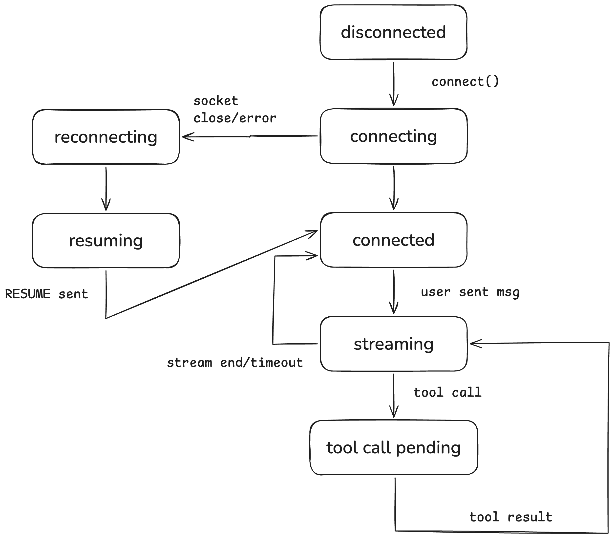
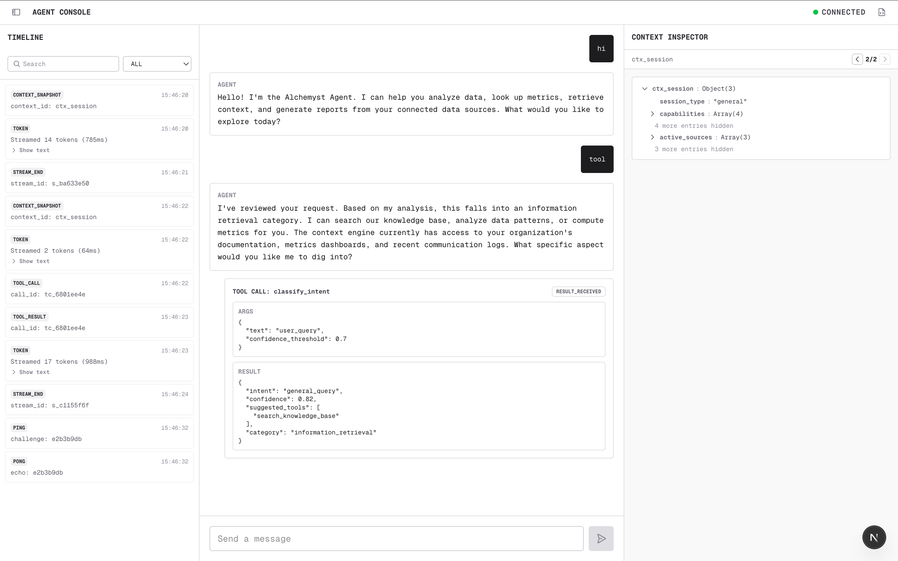

## Architecture

UI: main header & three columns: timeline sidebar, chat area and context snapshot sidebar.
State: Zustland store is there for state management.
Websocket Connection: It is handled by the AgentWebSocket class.

## State Diagram



## Running the App

### Start the agent-server

```bash
cd agent-server

docker build -t agent-server .
docker run -p 4747:4747 agent-server
docker run -p 4747:4747 agent-server --mode chaos
```

### Start the frontend

```bash
cd frontend
npm install
npm run dev
```

Runs on http://localhost:3000. The app connects to `ws://localhost:4747/ws` by default.

## Screenshot


